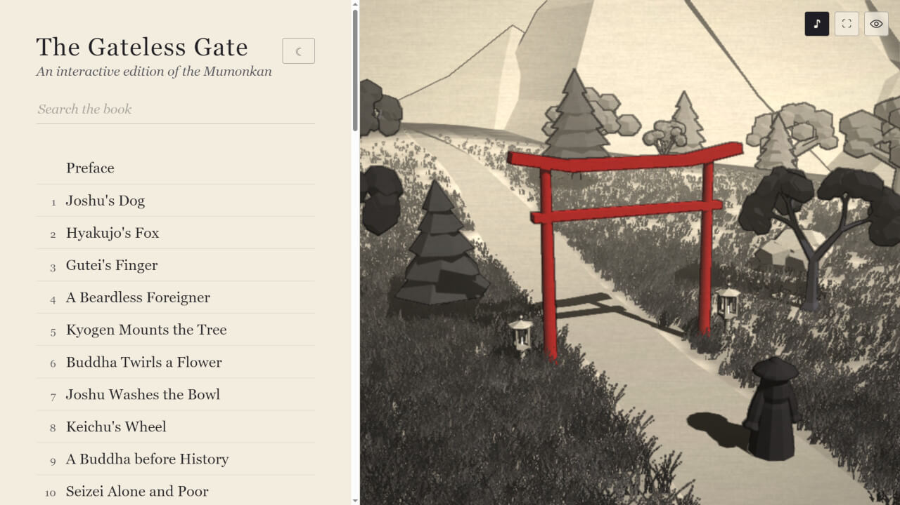

# The Gateless Gate 3D

*An interactive edition of the Mumonkan in your browser.*

## [Open the Gate](https://killedbyapixel.github.io/GatelessGate/)

Works on desktop and phone. No install, no sign-in, nothing to download.

The Mumonkan, "The Gateless Gate," is a collection of Zen koans put together in 1228.
Koans are short, strange stories a student sits with until something opens.
This edition turns that book into a place you can visit instead of pages you turn.

Every koan has its own diorama: black ink on paper, with an accent of red on whatever the story turns on.
All the art and sounds are drawn by code and generated on startup.
You can read the koans, meditate in the scenes, or have it read to you.

## What's inside

- **All forty-nine cases.** Each case has its own scene, the full text, and a spoken reading.
- **Scenes that answer back.** Optional touch feedback. A flag ruffles and settles, water rings, a bell sounds.
- **Atmospheric soundscape.** Diagetic sound from wind, bells, the occasional chime. Nothing is loud.
- **Read aloud.** One button steps the text aside, gives the diorama the whole window, and reads the page to you.
- **A timer for sitting.** From any case you can start a short meditation, opened and closed by a bell.

## The text

The whole book is also here as one plain page: [THE GATELESS GATE](THE-GATELESS-GATE.md).
It is generated from the same source the interactive edition reads, so the two cannot drift apart.
That source is [book/gateless-gate.md](book/gateless-gate.md) — the preface, the forty-nine and the afterword in one file — and `node scripts/build-text.js` is what turns it into what the site reads.
Beside it, [book/translation-notes.md](book/translation-notes.md) is the scholarly record behind the new translation: the Chinese, the exact Taishō page and line spans, the reasoning, and the readings still unresolved.

The English is Nyogen Senzaki and Paul Reps's rendering of the Mumonkan, privately printed by John Murray in Los Angeles in 1934 which is in the United States public domain.
Mumon's preface, his afterword, the Zen Warnings and Amban's letter were translated with AI assistance for this edition from the Chinese of the Taishō canon (CBETA T48n2005).
There were three independent passes, each made blind to the others and to any existing English version, then compared line by line, with every difference in meaning settled against the Chinese.
It is a new rendering and worth reading as one: it has had no scholarly review, please reach out if you are interested in doing one.
A few other small editorial changes were made along the way, and the book's own About page has the details.

## License

Shared under [Creative Commons Attribution-NonCommercial-NoDerivatives 4.0 International](https://creativecommons.org/licenses/by-nc-nd/4.0/).

This is a new edition of the Mumonkan rather than a reprint of an old one: the forty-nine cases have been edited and modernised throughout, and the preface and back matter were translated for it from the Chinese and appear in no earlier English edition.

That license covers: the code, the dioramas, the audio, the narration, the new translations of the front and back matter, and the editing of the cases, © 2026 Frank Force.

It does not cover the 1934 translation underneath that editing, which is public domain and nobody's to license, or Three.js in `lib/`, which is MIT and travels under its own terms.
[NOTICE.md](NOTICE.md) sorts out which is which, and [LICENSE](LICENSE) is the legal text.

## Still to come

This is a living project. Some of what's planned:

- **Richer scenes.** Better composition and more variety as the kit of parts grows, and more of each koan's particular weather.
- **A better reading.** Every case is read by a synthesized voice today. The whole book can be re-baked automatically, so the reading improves as the technology does.
- **More languages.** The text and its reading in other tongues, and one day the original Chinese beside the English, read aloud in its own voice.
- **Supplemental material.** Who these old masters were, some history, a pronunciation guide, and where to read further.
- **Index** An index of the people the book keeps returning to, each one leading back into the cases they walk through.
- **Offline.** Installable, so the whole book travels with you.
- **A koan a day.** One case each morning, if you'd like one.
