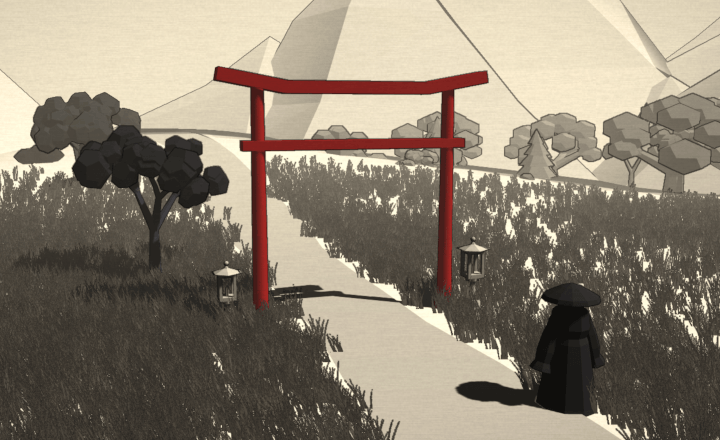

# Gateless Gate 3D

*An interactive sumi-e reading of the Mumonkan, in your browser.*

## [Enter the Gate](https://killedbyapixel.github.io/GatelessGate/)

Runs in the browser on desktop and phone. No install, no sign-in, nothing downloaded up front.

The **Mumonkan** — "The Gateless Gate" — is a thirteenth-century collection of forty-eight Zen koans.
Koans are small, strange stories a student sits with until something opens.
This is that book, reimagined as a quiet place you can visit rather than pages you turn.

Each koan is staged as its own low-poly diorama — black ink on paper, with a single mark of color on the thing the story turns on.
You read the case, its old master's commentary, and its closing verse.
You can have it **read aloud**, and ambient sound gives the scene its weather.

## What's inside

- **All forty-nine cases** — Mumon's forty-eight and Amban's traditional addition. Each case has its own scene, the full text, and a spoken reading.
- **Touch, if you like.** Scenes answer a little to a cursor or a tap. A flag ruffles and stills, water rings, a bell sounds.
- **Ambient sound** that is gentle by design: wind, bells, the occasional chime, tuned quiet.
- **Sit for a while.** From any case you can start a short meditation timer, opened and closed by a bell.
- **Read in any order.** A simple menu lists every case and tracks which ones have been visited.
- **Have it read to you.** One button steps the text aside, gives the diorama the whole window, and reads the page aloud.
- **Everything is drawn by code.** Every scene, model and sound is generated at runtime — no photographs, no downloaded models, no recorded music.

## The text

The whole book also sits here as a single readable page — [THE GATELESS GATE](THE-GATELESS-GATE.md) — generated from the same text the interactive edition reads, so the two cannot disagree.

The reading is the Nyogen Senzaki and Paul Reps English rendering of the Mumonkan, privately printed by John Murray in Los Angeles in 1934.
That printing is in the United States public domain — its copyright was never renewed — and Reps later expanded the material into *Zen Flesh, Zen Bones* (1957), the version most readers know.
Archaic verb forms and pronouns, which survive here and there in the capping verses, have been lightly modernized; Mumon's commentaries were already in plain modern English.

The 1934 printing carries the cases and nothing else.
Mumon's preface, his afterword, the Zen Warnings and Amban's letter were translated for this edition from the Chinese of the Taishō canon (CBETA T48n2005), in three independent passes made blind to one another and to any existing English version, then compared line by line with every divergence of meaning settled against the Chinese.
It is a new rendering and worth reading as one: it has had no scholarly review.
Other small editorial changes have been made and more may follow; the book's own About page carries the note.

The goal is something beautiful enough to draw in someone who has never heard of a koan, and faithful enough to reward someone who has.

## License

Shared under **[Creative Commons Attribution-NonCommercial-NoDerivatives 4.0 International](https://creativecommons.org/licenses/by-nc-nd/4.0/)** — credit it, don't sell it, don't publish a changed version of it.
That covers what is mine: the code, the dioramas, the audio, the narration, and the new translations of the front and back matter, © 2026 Frank Force.

It does not cover the 1934 translation of the forty-nine cases, which is in the public domain and nobody's to license, nor Three.js in `lib/`, which is MIT and travels under its own terms.
[NOTICE.md](NOTICE.md) sets out which is which; [LICENSE](LICENSE) is the legal text.

If you want to do something the license doesn't allow, ask — the answer is not automatically no.

## Still to come

This is a living project. Here is some of what's planned...

- **Richer scenes.** Deeper art as the kit grows — better composition, more variety, more of each koan's particular weather.
- **Improved reading.** Every case is read by a synthesized voice today. The whole book can be re-baked automatically, so the reading improves as speech technology does.
- **More languages.** The text and its reading in other tongues — and one day the original Chinese beside the English, read aloud in its own voice.
- **Supplemental material.** Who these old masters were, a little history, a pronunciation guide, where to read further — an index of the people the book keeps returning to, each leading back into the cases they walk through, for anyone the stories send looking.
- **Take it offline.** Installable, so the whole book travels with you with no connection at all.
- **A koan a day.** An optional gentle rhythm — one case each morning, if you'd like one.
